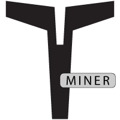

#  Lethean GUI Miner

The Lethean GUI miner is a beautiful, easy to use, interface for mining Lethean.

The goal of this software is to allow easy mining of Lethean coins, allowing simple and affordable access to the Lethean VPN Network.


We currently support two very popular miner backends:

1. [xmr-stak](https://github.com/fireice-uk/xmr-stak)
2. [xmrig](https://github.com/xmrig/xmrig) (see also [xmrig-nvidia](https://github.com/xmrig/xmrig-nvidia) and [xmrig-amd](https://github.com/xmrig/xmrig-amd))

## Compiling

### Linux

The miner GUI is built using [Electron](https://electronjs.org) and
[Go](https://golang.org) using the
[Astilectron app framework](https://github.com/asticode/astilectron).

* Install Go

[https://golang.org/dl/](https://golang.org/dl/)

* Install required Go packages

```shell
go get -u github.com/asticode/go-astilectron
go get -u github.com/asticode/go-astilectron-bundler/...
go get -u github.com/asticode/go-astichartjs
go get -u github.com/asticode/go-astilectron-bootstrap
go get -u github.com/google/uuid
go get -u github.com/mitchellh/go-ps
```

* Clone and build the app

```shell
git clone git@github.com:LetheanMovement/lethean-gui-miner.git lethean/gui-miner
cd lethean/gui-miner
make
```

NOTE: Ensure you clone the GUI miner into your working $GOPATH

If all goes well the binaries for Windows, macOS and Linux will be available in the `bin` folder.

Building is also possible on Windows by executing `astilectron-bundler -v` from the `src` folder, assuming $GOPATH is setup correctly.

## Credit

The original source for this GUI miner comes from [Stellite](https://github.com/stellitecoin/GUI-miner).
